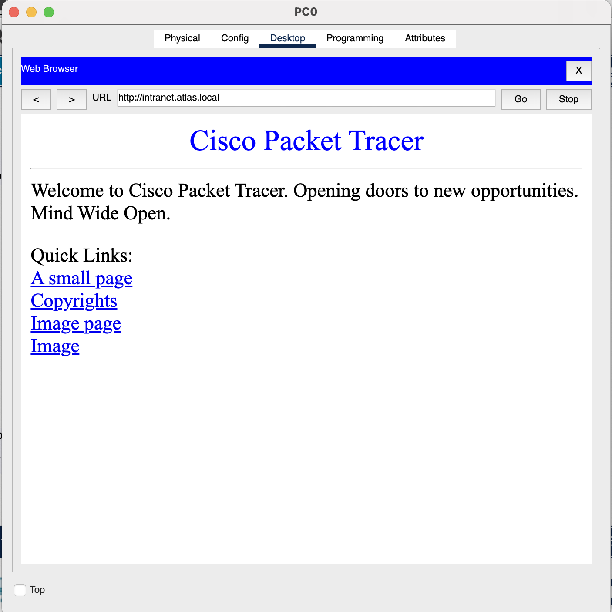
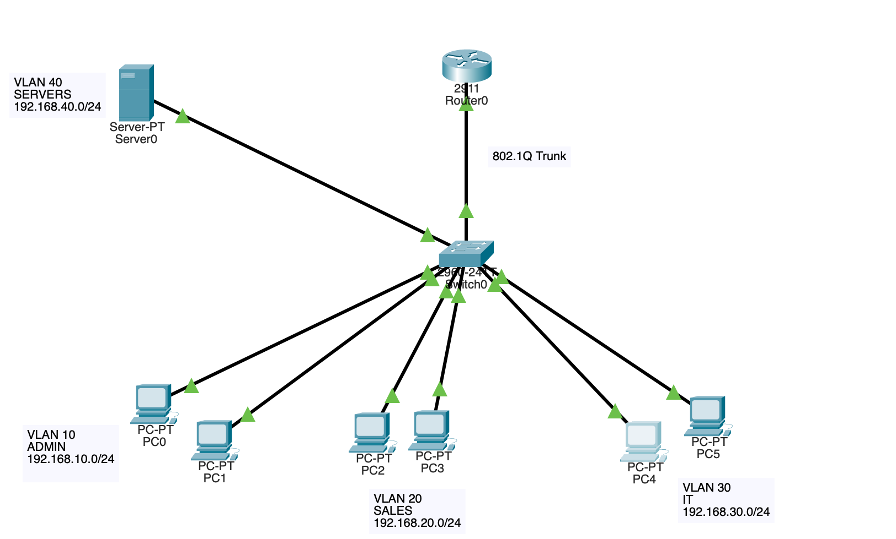
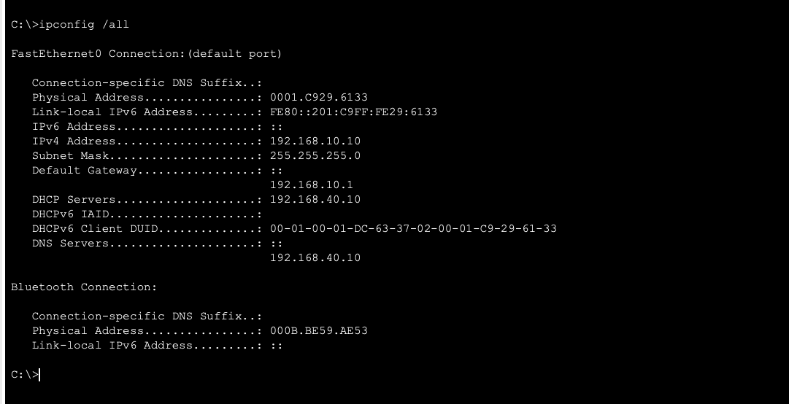

# DHCP, DNS & Network Services Lab

## Overview

This lab was built in Cisco Packet Tracer to practice configuring centralized network services across multiple VLANs.

I created four VLANs for separate departments, configured router-on-a-stick for inter-VLAN routing, and used a centralized server to provide DHCP, DNS, and HTTP services.

Because the DHCP server was located in a different VLAN from the client devices, I configured DHCP relay using `ip helper-address` to allow DHCP requests to reach the server across subnet boundaries.

## Lab Objectives

- Create and configure four VLANs
- Configure access ports for each VLAN
- Configure an 802.1Q trunk between the switch and router
- Configure router-on-a-stick for inter-VLAN routing
- Configure centralized DHCP pools
- Configure DHCP relay with `ip helper-address`
- Configure DNS name resolution
- Configure and test an HTTP web service
- Verify connectivity and troubleshoot configuration issues
## Network Design

| VLAN | Department | Network | Default Gateway | Devices |
|---|---|---|---|---|
| 10 | ADMIN | 192.168.10.0/24 | 192.168.10.1 | PC0, PC1 |
| 20 | SALES | 192.168.20.0/24 | 192.168.20.1 | PC2, PC3 |
| 30 | IT | 192.168.30.0/24 | 192.168.30.1 | PC4, PC5 |
| 40 | SERVERS | 192.168.40.0/24 | 192.168.40.1 | Server0 |

### Server Configuration

| Service | Configuration |
|---|---|
| Server IP | 192.168.40.10/24 |
| Default Gateway | 192.168.40.1 |
| DHCP | Centralized DHCP server for VLANs 10, 20, and 30 |
| DNS | 192.168.40.10 |
| DNS A Record | intranet.atlas.local → 192.168.40.10 |
| HTTP | Internal web service |
## Network Topology

The network uses four VLANs connected through a Cisco 2960 switch. A Cisco 2911 router provides inter-VLAN routing using router-on-a-stick. The switch-to-router connection is configured as an 802.1Q trunk.

## DHCP & DHCP Relay

Server0 was configured as the centralized DHCP server at `192.168.40.10`. Separate DHCP pools were created for the ADMIN, SALES, and IT VLANs.

| Pool | Starting IP | Default Gateway | DNS Server |
|---|---|---|---|
| ADMIN | 192.168.10.10 | 192.168.10.1 | 192.168.40.10 |
| SALES | 192.168.20.10 | 192.168.20.1 | 192.168.40.10 |
| IT | 192.168.30.10 | 192.168.30.1 | 192.168.40.10 |

Because DHCP clients initially send broadcast requests and routers do not normally forward broadcasts between subnets, clients in VLANs 10, 20, and 30 could not directly reach the DHCP server in VLAN 40.

DHCP relay was configured on the router subinterfaces:

```cisco
interface g0/0.10
 ip helper-address 192.168.40.10

interface g0/0.20
 ip helper-address 192.168.40.10

interface g0/0.30
 ip helper-address 192.168.40.10
```

## DNS & HTTP Services

Server0 was also configured to provide DNS and HTTP services.

An IPv4 A record was created to map the internal hostname to the server:

`intranet.atlas.local` → `192.168.40.10`

Clients received `192.168.40.10` as their DNS server through DHCP.

To verify name resolution and application connectivity, PC0 accessed `intranet.atlas.local` through its web browser. DNS resolved the hostname to Server0's IP address, and the HTTP page loaded successfully across VLANs.







## Troubleshooting

### 802.1Q Trunk Not Forming

During configuration, the switch-to-router connection was not operating as a trunk. Verification showed that the switch interface was still using `dynamic auto`.

Because the router does not negotiate a trunk using DTP, I manually configured the switch interface:

```cisco
interface gi0/1
 switchport mode trunk


